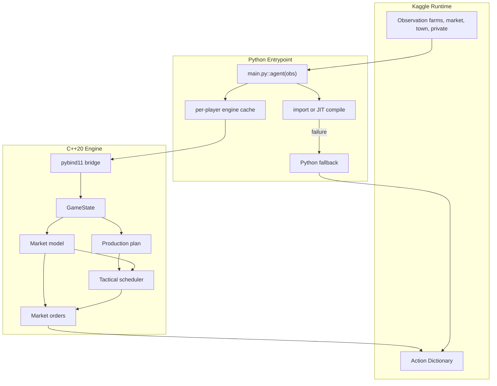
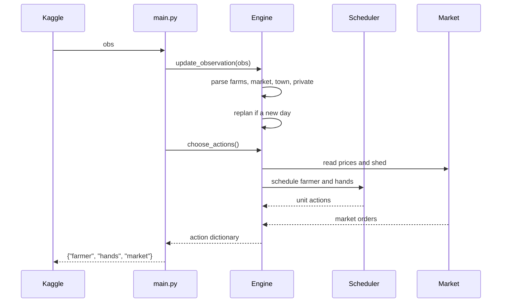

# Architecture

This document describes the Kaggriculture native engine: its layers, data flow, market model, planning approach, tactical scheduler, and the Python API.

## Overview

The system is split along ownership boundaries. Python owns the Kaggle lifecycle, native import and JIT compilation, fallback behavior, and packaging. C++ owns the decision paths: observation ingestion, market modeling, production planning, per-turn scheduling, and action serialization.

Kaggriculture is an economic planning problem over a shared, town-drained market. The agent projects prices from a shared-inventory model, plans a production schedule sized to market absorption, and executes it with a deadline-aware scheduler that allocates the farmer and farm hands each turn.

## System Layers

| Layer | Implementation | Responsibility |
| --- | --- | --- |
| Kaggle entrypoint | `main.py` | Persistent per-player engines, native import or JIT build, champion loading |
| Python/C++ bridge | `src/kaggriculture_bindings.cpp` | Observation conversion, hyperparameter injection |
| State containers | `src/kaggriculture_state.cpp` | Farm, tile, market, town, and private state |
| Market model | `src/include/constants.hpp` | Per-resource price curves and shape functions |
| Simulator | `src/kaggriculture_sim.cpp` | Exact turn resolution matching the interpreter |
| Planner | `src/kaggriculture_plan.cpp` | Production targets from the hyperparameters |
| Tactical scheduler | `src/kaggriculture_tactical.cpp` | Per-turn farmer/hand actions and market orders |
| Facade | `src/kaggriculture_engine.cpp` | Wires planning and scheduling for one player |

Headers live in `src/include/` under `constants.hpp`, `board.hpp`, `market.hpp`, `plan.hpp`, `tactical.hpp`, `engine.hpp`, and `kaggriculture_internal.hpp`.

## Data Flow



## Native Turn Pipeline

Each turn the entrypoint loads the observation into the native `GameState`, updates the production plan at day boundaries, and asks the engine to choose actions under the per-turn budget.



## Market Model

The price of each product follows a per-resource curve anchored at the shared inventory `I0 = 10000`:

```math
\text{price}(\text{inv}) = \text{base} + \text{sign} \cdot \text{amp} \cdot f(|\text{inv} - I_0|)
```

where `sign` is positive below `I0` (scarcity raises the price) and negative above it (glut lowers it), `amp = target * base / f(T)`, and `f` is one of `linear`, `sq`, `sqrt`, `log`, `log10`. The price is floored at `$1` and rounded to the nearest dollar. The exact per-resource parameters are encoded in `constants.hpp` and match the published table.

Premium goods (strawberry, melon, milk, wool) have steep above-equilibrium curves and crash to the floor near their `T` calibration. Staples (wheat, carrot, egg) absorb gluts. Town consumption drains inventory over the season, which trends prices upward.

## Production Planning

`make_plan` derives per-crop and per-animal production targets from the tuned hyperparameters. The planner counts current plantings and animals on the farm and in the shed, and the order layer buys seeds and animals to close the gap. The plan is stable across a season so the market and order layers do not over-commit capital from day to day.

## Tactical Scheduler

Each turn the scheduler builds a priority task queue:

- Priority 0: water plants and feed animals that are one day from decay or escape.
- Priority 1: harvest ready yields and drop carried goods at the shed.
- Priority 2: build structures for planned animals, pick up animals and wheat, and place animals.
- Priority 3: plant planned crops that will mature before the season ends.
- Priority 4: collect animal fertilizer and care for animals.
- Priority 5: dig weeds.

Units are assigned to tasks with a nearest-pair greedy over BFS distances on the 10 by 10 board. A unit moves toward its task one step per turn and performs the action on arrival. Placement requires the animal in the unit's inventory, and feeding requires wheat in the unit's inventory, which the pickup tasks supply.

### Market Orders

Orders are built with a fixed priority: sell first to free shed capacity, then buy land, buy seeds, buy animals, buy wheat for feed, and finally hire hands in the remaining slots. Selling is demand-matched around town consumption ticks: premium goods are sold only when the market is scarce, while staples are sold more freely. The shed capacity of 100 bounds how much can be held between sales.

## Simulator

`apply_turn` reproduces the Kaggle interpreter exactly: unit-action validation, atomic plant handling, the per-unit market lockstep, town consumption, plant decay, and the end-of-day refresh for plants, animals, weeds, shed drops, farmer and hand reset, and shop unlocks.

## Environment Rules Fidelity

The engine is calibrated against the `kaggle-environments` interpreter:

- Seeds must be watered the day they are planted or they become weeds.
- One-time crops start with one yield unit and gain a bonus per watered day inside the yield window.
- Ongoing crops produce on fixed intervals and decay after the production cap.
- Animals produce while fed; care banks a bonus applied on the next fed production day.
- Fleets are not a factor; the shared market and town are the only interactions.

`scripts/diffcheck.py` guards the entrypoint against regressions in action legality and turn handling.

## Python API

The pybind module exposes a compact API:

```python
import kaggriculture_engine

engine = kaggriculture_engine.Engine()
engine.update_observation(obs, config)
actions = engine.choose_actions(900)
```

Hyperparameters are injected per engine:

```python
engine.set_hyperparameters({"target_cows": 4, "wheat_tiles": 24, "max_hands_per_day": 6})
print(engine.get_hyperparameters())
```

The module also exposes the exact `market_price(item, inventory)` and `shape_value(func, x)` helpers for testing.

## Threading and Performance

- The per-turn decision runs allocation-free in fixed `std::array` storage.
- A full-season forward simulation completes in well under a second, leaving ample headroom inside the one-second Kaggle budget.
- The scheduler uses only stack-allocated buffers and a small BFS queue.
