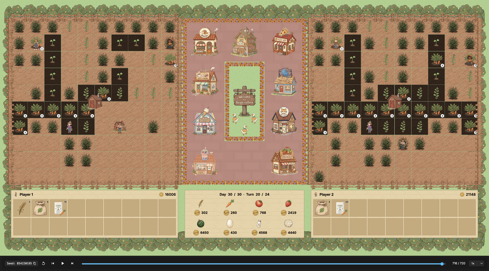

# Kaggriculture Simulated Planning

A native C++20 agent for Kaggle Kaggriculture based on market-aware simulated planning.

The repository implements a high-performance C++20 engine exposed to Kaggle through a thin Python entrypoint. The agent forecasts the shared dynamic market, plans a crop and animal production schedule, and executes it with a per-turn tactical scheduler that times sales around town demand. The Python layer handles Kaggle lifecycle, native import and JIT compilation, and per-player engine caching.

<figure>
  
</figure>

## Overview

Kaggriculture is a two-player farming simulation. Each player manages a 10 by 10 farm over a 720-turn season, buying seeds and livestock, planting, watering, harvesting, and selling to a dynamic market drained by a town. The winner is the player with the most money in the bank at the end. The full rules are documented in [rules/README.md](./rules/README.md).

The agent treats the game as an economic planning problem. Production must be sized to the market's absorption capacity, because premium goods crash to a $1 floor when oversupplied while staples absorb gluts. The engine therefore projects prices from a shared-inventory model, times sales just after town consumption ticks, and allocates labor to watering, feeding, harvesting, and shed logistics.

## Key Characteristics

- Native C++20 hot path for market modeling, planning, and the per-turn scheduler.
- Exact market price model matching the published per-resource curves.
- Demand-matched premium selling timed to town consumption.
- Deadline-aware farmer and farm-hand scheduling with BFS pathfinding.
- Fixed-capacity state containers with no dynamic allocation in the hot path.
- Source-first Kaggle packaging: the submission JIT-compiles the extension at runtime.
- Configuration-driven hyperparameters from `config/hyperparameters.json`.

## Repository Layout

```text
.
├── CMakeLists.txt            CMake build definition for the pybind11 extension
├── Makefile                  Convenience targets (build, test, tune, bench, package)
├── pyproject.toml            Tooling configuration (pytest, ruff)
├── requirements-dev.txt      Development dependencies
├── main.py                   Kaggle entrypoint (agent, native import, JIT)
├── submission.py             Local alias exposing main.agent
├── config/
│   ├── hyperparameters.json  Single source of truth for tuned parameters and bounds
│   └── league.json           Opponent registry for tuning and benchmarking
├── docs/
│   ├── BENCHMARKING.md       Evaluation protocol and Elo ladder
│   ├── TUNING.md             Tuning system deep dive
│   └── benchmarks/           Benchmark report output directory
├── opponents/                Hand-crafted opponent archetypes
├── rules/
│   ├── README.md             Authoritative competition rules
│   └── AGENTS.md             Getting-started guide
├── scripts/
│   ├── tune.py               Optuna tuning harness
│   ├── bench.py              Champion benchmark harness
│   ├── diffcheck.py          Differential rules-fidelity check
│   ├── profiling.py          Per-turn latency profiler and perf gate
│   └── package_submission.py Kaggle source bundle builder
├── src/
│   ├── kaggriculture_*.cpp   Native engine implementation files
│   └── include/              Engine headers (constants, board, market, engine)
├── tests/                    pytest suite (bridge, market, sim, opponents, packaging)
└── tuning/                   Reusable tuning package (schema, league, runner, reporting)
```

## Quickstart

### Prerequisites

- Python 3.11 or newer.
- CMake 3.20 or newer.
- A C++20 compiler with Python development headers.
- The packages in `requirements-dev.txt`.

### Set Up the Environment

```bash
python -m venv .venv
source .venv/bin/activate
python -m pip install --upgrade pip
python -m pip install -r requirements-dev.txt
```

### Build

```bash
make build
```

### Test

```bash
make test
```

The suite covers the pybind bridge, the market price model, gameplay smoke, opponent archetypes, and packaging. Run it directly with `PYTHONPATH=build python -m pytest -q tests`.

### Verify Rules Fidelity

```bash
make diffcheck
```

`scripts/diffcheck.py` plays short games with the native agent and verifies the games complete without invalid or error statuses.

### Run a Minimal Local Call

```bash
PYTHONPATH=build python - <<'PY'
from types import SimpleNamespace
from main import agent

obs = SimpleNamespace(
    player=0, step=0, day=0, hour=0,
    farms=[{"money": 3000.0, "tiles": [[None] * 10 for _ in range(10)],
            "farmer": [4, 4], "hands": [], "unlocked_quadrants": ["NW"], "hires_today": 0}] * 2,
    market={"inventory": {}, "prices": {}},
    town={"unlocked_shops": []},
    private={"shed": {}, "seeds": {}, "inventories": [{}]},
)
print(agent(obs))
PY
```

### Tune and Benchmark

```bash
make tune
make bench
```

See [docs/TUNING.md](./docs/TUNING.md) and [docs/BENCHMARKING.md](./docs/BENCHMARKING.md) for details.

### Package and Submit

```bash
make package
kaggle competitions submit kaggriculture -f submission.tar.gz -m "kaggriculture-simulated-planning"
```

`scripts/package_submission.py` writes `submission.tar.gz` containing `main.py`, all C++ sources, the headers under `src/include/`, and vendored pybind11 headers. At runtime `main.py` imports a prebuilt extension if available, otherwise it JIT-compiles the sources.

## Documentation Map

- [ARCHITECTURE.md](./ARCHITECTURE.md): system layers, data flow, market model, scheduling, and Python API.
- [CONTRIBUTING.md](./CONTRIBUTING.md): development workflow, build and test guidance, and code style.
- [docs/TUNING.md](./docs/TUNING.md): tuning system, schema, Optuna runner, and opponent league.
- [docs/BENCHMARKING.md](./docs/BENCHMARKING.md): evaluation protocol and confidence intervals.
- [rules/README.md](./rules/README.md): authoritative competition rules and configuration defaults.

## License

This repository is distributed under the Apache License 2.0. See [LICENSE](./LICENSE).
